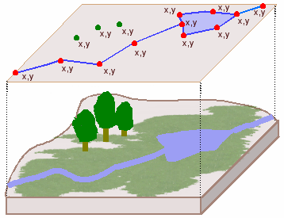

# 1. INTRODUCTION

## 1.1 Lesson Objectives
-   Discuss the importance of location in environmental data analysis
-   Examine how spatial features are stored in R: "Simple Features" and the `sf` package
-   Review coordinate reference systems (CRS) and discuss their importance
-   Examine a simple spatial analysis using the `sf` package

## 1.2 Discussion: The importance of location in environmental data analysis

We've spent time exploring how to wrangle data tables to reveal new information. An important step forward came when we joined two datasets on a common attribute (e.g. joining physical and nutrient attribute tables for LTER lakes), which allowed us to examine relationships across these two sources.

With GIS and spatial analysis, we don't necessarily need a common attribute to join tables from different sources; instead, we can use location. Thus, if we know the location of our NTL-LTER lakes, we can compute their distances from the EPA air quality monitoring locations to explore possible relationships between the two data sets. Thus, location is quite a powerful ally in environmental data analysis.

In this lesson, we explore how data can be represented spatially, and how we can use location to query and analyze data. We'll introduce some useful R libraries for handling, analyzing, and visualizing spatial datasets.

## 1.3 Setup: Installing the necessary packages

The packages we'll need for this lesson are below. Install as necessary and ensure they can each be imported without error.

```{r Install packages, message=FALSE, warning=FALSE}
#Import the tidyverse library 
library(tidyverse, quietly = TRUE)
library(lubridate)

#install.packages('sf')
library(sf)
#install.packages('leaflet')
library(leaflet)
#install.packages('mapview')
library(mapview)

#Disable on-the-fly projections
sf::sf_use_s2(FALSE)
```

---

# 2. REPRESENTING SPATIAL DATA IN R

## 2.1 Simple feature geometry (sfg)
The `sf` package enables a new data type to be included in our data frames - the **geometry** data type. Geometries are comprised of coordinate pairs that form to create **geometric objects**. These can be:
-   **points** - created from a single coordinate pair; 
-   **lines** - created from a sequence of coordinate pairs representing the start, the end, and any vertex along the line (i.e. where it changes direction); and
-   **polygons** - also created from a sequence of coordinate pairs, but where the first and last pair are in the same location, thus closing the shape and defining an area. 

These geometries represent features located in geographic space. (There are other geometry types, with a full set listed [here](https://bit.ly/3hrPcZO). However, to keep things simple, we'll focus on points, lines, and polygons.)


## 2.4 Coordinate reference systems (crs)
A **coordinate reference system** or **crs** includes the information used to reference the coordinates used in defining a geometry with actual geographic locations. These will be discussed more later. 

## 2.3 Simple feature: geometry + attributes + crs
A **simple feature** is one geographic element along with it's attributes. In other words, it's a row in a dataframe when that dataframe includes a column for geometry. 

## 2.4 Spatial dataframe 
A **spatial dataframe**, also referred to as **simple features** (or `sf`), **spatially enabled dataframe**, or **geodataframe** is a collection of simple features (geometry + attribute + crs) stored in the format of a dataframe. It inherits all the capabilities of a standard dataframe but also has spatial analysis capabilities. 

## EXERCISE: Exploring Spatial Data
Let's read some geospatial data into our coding environment. The file we'll read comes in GeoJSON format, which is a standard, open source format for storing geospatial data. The file we'll use is located on-line, obtained via the NC OneMap geospatial portal: https://www.nconemap.gov/datasets/manufactured-gas-plant-sites/explore
-   From the above website, click on the`View Full Details` link. 
-   From here you could download the data, but we'll link to the data directly. 
-   Find and extend the dropdown list for `View API Resources`
-   Copy the link associated with the `GeoJSON` service

```{r Read in road data}
#Read a spatial dataset
GasPlants <- st_read('https://opendata.arcgis.com/datasets/a0722062315143a7980cebb79a204781_4.geojson')
#Alternative
#GasPlants <- st_read('./Data/Spatial/Manufactured_Gas_Plant_Sites.geojson')

#Explore
class(GasPlants)
names(GasPlants)
str(GasPlants$geometry)

#View using sf plot
plot(GasPlants['STATUS'],pch=16)

#View using ggplot
ggplot(data=GasPlants) + geom_sf()

#View using mapview
mapview(GasPlants)

```


## EXERCISE: Creating a spatial dataframe from coordinate columns

```{r Create a spatial dataframe from coordinate data}

#Read in our processed EPA Air dataset, setting the Date column to be dates
EPAair <- read.csv("./Data/Processed/EPAair_O3_PM25_NC2021_Processed.csv", stringsAsFactors = TRUE) %>% 
  mutate(Date = ymd(Date))

#Wrangle so each site has only one record, computing mean ozone and PM2.5 at that site
EPAair.sites <- EPAair %>% 
  group_by(Site.Name, COUNTY, SITE_LATITUDE, SITE_LONGITUDE) %>% 
  summarize(
    mean_Ozone = mean(Ozone, na.rm=T),    #What does "na.rm=T" do? Is it necessary?
    mean_PM25 = mean(PM2.5, na.rm=T),
    count_all = n(),
    count_Ozone = sum(!is.na(Ozone)),
    count_PM25 = sum(!is.na(PM2.5)))

#Convert to a spatial dataframe
EPAair.sf <- EPAair.sites %>% 
  st_as_sf(coords = c('SITE_LONGITUDE','SITE_LATITUDE'),
           crs=4326)

#View the data using the methods above...

```

### EXERCISE: Creating a spatial dataframe from known coordinates

```{r Create a spatial dataframe from scratch}
#First create a simple feature geometry object ("sfg")
sfg_GraingerHall <- st_point(c(-78.9427,36.00465))
class(sfg_GraingerHall)
mapview(sfg_GraingerHall)

#Upgrade to a simple feature geometry column by adding a crs 
sfc_GraingerHall <- st_sfc(sfg_GraingerHall,crs=4326)
class(sfc_GraingerHall)
mapview(sfc_GraingerHall)

#Upgrade to a spatial dataframe
sf_GraingerHall <- st_as_sf(sfc_GraingerHall)
sf_GraingerHall$Name = 'Grainger Hall'
mapview(sf_GraingerHall)

```

## 2.5 Summary
So, we see that our "sf" dataframe works much like our familiar dataframe, only it has a new column containing *geometries* for each record. This pretty much sums up what a GIS is: a familiar table of records and attributes (i.e. an "Information System"), but with one attribute that includes a geometry that allows us to incorporate geography into our analysis (i.e. a "*Geographic* Information System")!

---

# 3. COORDINATE REFERENCE SYSTEMS
Each of the above datasets we explored use lat/long coordinates in defining their geometries. We actually specify that these use lat/long coordinate when creating them via the `crs = 4326` parameter you see in the examples. But what is "4326"?? And what is the significance of this? 

Let's explore:

## EXERCISE: Buffering - a simple spatial analyis
"Buffering" a simple feature extends the area outward a specified distance. The code below buffers Grainger Hall 1 "unit". 
```{r buffer Grainger hall}
#Buffer Grainger Hall 1 unit
the_buffer <- sf_GraingerHall %>% st_buffer(1)

#View the result
mapview(the_buffer)
```

A bit odd, no? Why is the circle so big? What is the units of '1'? And why is it oval, not a circle? This has much to do with the fact that the geometric units of our feature are measured in angular units (degrees) and not familiar planar ones (like meters or feet). And that's because latitude and longitude measure location on a sphere, and we like doing calculations on a plane...

## 3.1 Projecting data

Projecting data is the process of converting spherical coordinates to Cartesian or planar coordinates, e.g. so we can perform calculations on our data more easily. Projecting data, however, faces two problems: 

 * You can't flatten a sphere into a plane without distorting area, distance, shape, and/or direction.
 
 * The earth is not a perfect sphere to begin with.

The "solution" to these issues involves creating a vast number of different coordinate reference systems, each consisting of:

1. A mathematical representation of the earth's shape, often constrained to a specific extent to enhance accuracy at that extent (at the cost of increased distortion away from that extent). These representations are referred to as the `datums`, `spheroids`, or `ellipsoids` of a specific coordinate reference system. 

2. A coordinate system, defined by the units of measurement (either angular [degrees], or planar [meters or feet]), and the location of its origin. Projected coordinate systems tend to be more accurate at their origin, with distortion increasing as you move away; thus you'd want to select a coordinate reference system who's origin is closest to the features in your analysis. 

All simple features need to be associated with a defined coordinate reference system. The crs can be *geographic*, where coordinate values remain in angular units, or *project* where the angular units have been translated into planar ones using some form of projection method. The crs associated with the simple features provides critical information for processing spatial analyses such as computing distances, calculating areas, etc. It also enables datasets using one crs to be **transformed** into another crs so that analyses can be done across spatial datasets.  


## 3.2  EPSG codes and "PROJ4Strings"

The "4326" in the `crs = 4326` is an EPSG code, a number used to look up a specific crs.

The website <http://spatialreference.org/> lists hundreds of standard CRS along with a map and description of where it's appropriate. For example, a useful one in North Carolina is [UTM Zone 17N-NAD 83](http://spatialreference.org/ref/epsg/nad83-utm-zone-17n/). Note also that its *EPSG code* is `26917`; this EPSG code one way we can assign a CRS to our data. If you click on the the "Well Known Text as HTML" link, it will reveal all the specific associated with that CRS... (Another site listing coordinate reference systems is <http://www.epsg.org/>)

Some CRS, however, do not have an associated EPSG code, and for those, we can use the "proj4string", which is a long hand form of the projection information. Just to make it more confusing, some coordinate systems have a "WKT" or "Well known text" code.Mostly, these are all interchangeable and the important bit here is that you understand the need for and requirements of associating a CRS with a spatial dataset. I found this site gives a useful overview of the nuances of coordinate systems: <https://bit.ly/2XUGMyX>

### 3.2.1 Some commonly used CRS

**EPSG:4326**

WGS 84 or WGS84 (World Geodetic System 1984, used in GPS) <http://epsg.io/4326>

**EPSG:102008**

NAD83 / North America Albers Equal Area Conic <http://epsg.io/102008>

**EPSG:various UTM**

Universal Transverse Mercator (UTM) You need to find your UTM zone and then determine EPSG from there. To look up your zone go to [this website](https://mangomap.com/robertyoung/maps/69585/what-utm-zone-am-i-in-#).

### 3.2.2 A Quick Reference for CRSs in R

National Center for Ecological Analysis and Synthesis created a CRS summary sheet. Useful quick reference as well as background if you don't have much knowledge of all the various choices presented.

<https://www.nceas.ucsb.edu/~frazier/RSpatialGuides/OverviewCoordinateReferenceSystems.pdf>

## 3.3 More info on coordinate systems/projections:

-   Great video on projections: [link](https://www.youtube.com/watch?v=kIID5FDi2JQ)
-   Nice overview of coordinate systems [link](https://www.nceas.ucsb.edu/~frazier/RSpatialGuides/OverviewCoordinateReferenceSystems.pdf)
-   Some comic relief from xkcd! [link](https://xkcd.com/977/)
-   Visualizing all the different projections [link](https://map-projections.net/singleview.php)

---

## EXERCISE: Spatial Analysis
Say we want to the distance between our EPA sites and the nearest Gas Plant. We don't want to report the distances in degrees, so we first want to project our data into a projected crs. We'll use the UTM Zone 17 N - WGS84 crs (EPSG = 32617) 


```{r Transform the dataset}
#Transform the datasets to use UTM 17 N, WGS84
EPAair.sf.utm <- st_transform(EPAair.sf,32617)
GasPlants.utm <- st_transform(GasPlants,32617)

#Have a look at the coordinate associated with the geometries
EPAair.sf.utm$geometry[1]

#Plot the data
ggplot() +
  geom_sf(data = EPAair.sf.utm,color='blue') + 
  geom_sf(data = GasPlants.utm,color='red',shape='O') 

#Create a distance matrix between the point in each dataset
distance_matrix <- st_distance(EPAair.sf.utm, GasPlants.utm, pairwise=T)

#Compute the mean of each row (each EPA site)
mean_distances <-  rowMeans(distance_matrix)

#Add as a column to the epa sites
EPAair.sf.utm  <-  EPAair.sf.utm %>% 
  bind_cols(mean_distances)


```

